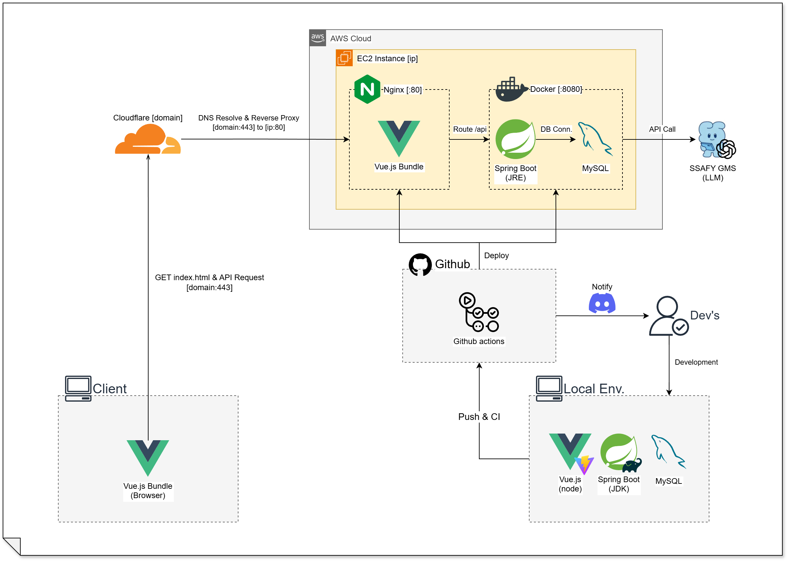

# AI 기반 물류 분석 플랫폼

> **자연어 인터페이스 기반의 런타임 데이터 파이프라인 및 배치 생성 엔진**
> 

현장 실무자가 IT 지식 없이 대화만으로 데이터를 분석하고, 반복 보고 업무를 자동화하는 환경을 구축합니다.

## 프로젝트 개요 (Overview)

본 프로젝트는 물류 현장의 데이터 접근성 문제를 해결하고 업무 효율을 극대화하는 것을 목표로 합니다.
> 

#### 기획 배경 & 문제 정의

제조·물류 현장에는 생산, 설비, 재고 등 방대한 데이터가 축적되지만, 실무자가 이를 활용하기에는 높은 장벽이 존재합니다.
> 

| 분류 | 현상 및 문제점 | 결과 |
| --- | --- | --- |
| 데이터 접근 | SQL 작성 능력 및 DB 구조 이해 부족 | IT 담당자에게 데이터 추출 요청 의존 |
| 데이터 해석 | 생산/재고 등 복잡한 데이터 간 연결 미흡 | 문제 발생 시 원인 파악 및 대응 지연 |
| 생산성 | 주/월간 리포트 작성을 위한 수작업 반복 | 부서 간 불필요한 커뮤니케이션 비용 등 업무 비효율 발생 |

### 프로젝트 목표

- **데이터 접근 장벽 제거:**
    - SQL 지식 없이 자연어만으로 모든 제조·물류 데이터를 직접 조회할 수 있는 환경 구축
    - 생산, 설비, 품질, 재고, 출하 데이터를 통합적으로 분석할 수 있는 기능 제공
- **현장 대응 속도 향상:**
    - 문제 감지 ~ 데이터 확인까지 수일에서 수초로 단축
    - 라인별, 설비별, 제품별 지표 비교로 문제 발생 지점 신속 파악
- **반복 업무 완전 자동화:**
    - 자연어로 생성한 분석 쿼리를 정기 배치로 등록, 주간·월간 보고서 자동 생성
    - 코드 재배포 없이 실무자가 직접 배치 스케줄을 등록·수정·삭제
- **시스템 안전성 및 성능 확보:**
    - 자연어 → SQL 변환 시 구문 검증, DDL/DML 차단, Read-only 권한 격리 적용
    - 데이터 정제 파이프라인으로 AI 응답 속도 및 정확도 향상

## 주요 기능 (Key Features)

1. **지능형 데이터 인터페이스 (NL2SQL)**
    - **맥락 인식형 쿼리 생성**: DB 메타데이터를 학습한 AI가 자연어 질문을 정확한 SQL 명령어로 변환합니다.
    - **안전한 실행 샌드박스**: 구문 검증 → SQL 리뷰 → 의미론적 검증까지 3단계 안전장치를 거쳐 DB 보안을 유지합니다.
2. **자율형 업무 자동화 (Dynamic Batch)**
    - **런타임 배치 등록**: 코드 재배포 없이 사용자의 요청에 따라 실시간으로 분석 스케줄(Cron)을 생성 및 수정합니다.
    - **업무 이력 통합**: 요청한 데이터 질의와 생성된 리포트 이력을 한눈에 관리하여 팀 내 공유 프로세스를 통합합니다.
3. **직관적 데이터 시각화 & 최적화**
    - **자동 차트 추천**: 데이터 특성에 맞는 최적의 시각화 결과물(Chart)을 AI가 스스로 판단하여 제시합니다.
    - **데이터 정제 파이프라인**: 요약 테이블(Summary) 생성으로 AI 응답 속도와 분석 정확도를 높입니다.

## 핵심 개념 (Core Concepts)

- **Talk to Data**: SQL 없이 일상 언어로 데이터와 직접 소통
- **Smart Logic Gen**: AI가 생성하고 시스템이 검증하는 안전한 쿼리 엔진
- **Zero-touch Reporting**: 런타임 스케줄링을 통한 정기 업무의 완전 자동화
- **Visual Insights**: 데이터 특성에 최적화된 자동 시각화 대시보드

## 기술 스택

### Backend

| 분류 | 기술 |
|------|------|
| Runtime | Java 21 |
| Framework | Spring Boot 4.0.6 |
| Build | Gradle (Multi-module) |
| ORM | Spring Data JPA (Hibernate) |
| Database | MySQL 8.0 |
| Security | Spring Security + JWT (jjwt) |
| AI/LLM | LangChain4j + OpenAI |
| API Docs | SpringDoc OpenAPI (Swagger) |

### Frontend

| 분류 | 기술 |
|------|------|
| Framework | Vue 3.5 (Composition API) |
| Language | TypeScript |
| Build | Vite |
| State | Pinia |
| CSS | Tailwind CSS 4 |
| Icons | Lucide Vue |
| Markdown | marked + DOMPurify |

### DevOps

| 분류 | 기술 |
|------|------|
| Container | Docker + Docker Compose |
| CI/CD | GitHub Actions |
| Registry | GitHub Container Registry |

## 시작하기 (Getting Started)

### 사전 요구사항

- Java 21
- Docker + Docker Compose
- Node.js 20.19+ / 22.12+
- OpenAI API Key

### 백엔드 실행

```bash
cd backend

# .env, .secret.env 파일 생성 후 환경 변수 설정
# (DB 접속 정보, JWT 시크릿, OpenAI API Key 등)

docker compose up -d --build
```

### 프론트엔드 실행

```bash
cd frontend

npm install
npm run dev
```

### 접속 정보

> 배포 URL: **https://mallo.cloud**

## 프로젝트 구조

```
ssafy-pjt/
├── backend/
│   ├── src/main/java/com/ssafy/demo_app/
│   │   ├── api/                  # Controller + DTO
│   │   │   ├── ai/               # AI 챗봇
│   │   │   ├── auth/             # 인증
│   │   │   ├── user/             # 사용자 관리
│   │   │   ├── item/             # 품목 마스터
│   │   │   ├── partner/          # 거래처 마스터
│   │   │   ├── bom/              # BOM
│   │   │   ├── routing/          # 라우팅
│   │   │   ├── inbound/          # 입고 관리
│   │   │   ├── inventory/        # 재고 관리
│   │   │   ├── production/       # 생산 관리
│   │   │   ├── shipping/         # 출하 관리
│   │   │   └── dashboard/        # 대시보드
│   │   ├── domain/               # Entity + Repository + Service
│   │   ├── global/               # 공통 설정/예외/응답
│   │   └── infrastructure/       # Security + JWT
│   ├── sql/                      # DB 초기화 스크립트
│   ├── docker-compose.yml
│   ├── Dockerfile
│   └── run_docker.ps1
│
├── frontend/
│   ├── src/
│   │   ├── api/                  # API 호출
│   │   ├── services/             # 비즈니스 로직
│   │   ├── state/                # Pinia Store
│   │   ├── views/                # 페이지 컴포넌트
│   │   ├── ui/                   # UI 컴포넌트
│   │   └── router/               # 라우트
│   └── package.json
│
└── .github/workflows/
    ├── backend-ci.yml
    ├── frontend-ci.yml
    └── deploy-main.yml
```

## API 문서

주요 API 엔드포인트:

| 도메인 | Method | Endpoint | 설명 |
|--------|--------|----------|------|
| Auth | POST | `/api/auth/login` | 로그인 |
| Auth | POST | `/api/auth/reissue` | 토큰 갱신 |
| Users | GET | `/api/users` | 사용자 목록 |
| Inbounds | GET/PATCH | `/api/inbounds` | 입고 접수 관리 |
| Inventories | GET | `/api/inventories` | 현재고 조회 |
| Work Orders | GET/POST | `/api/work-orders` | 작업 지시 관리 |
| Shippings | GET | `/api/shippings` | 출하 지시 목록 |
| AI | POST | `/api/ai/queries` | 자연어 질의 전송 |
| Dashboard | GET | `/api/dashboard/summary` | 대시보드 요약 |

> 전체 API 명세는 애플리케이션 실행 후 `/swagger-ui/index.html` 에서 확인할 수 있습니다.

## CI/CD

```
task & feature  ──PR──▶  dev  ──PR──▶  main  ──▶  GHCR  ──▶  EC2
```

| 워크플로 | 트리거 | 주요 작업 |
|---------|--------|---------|
| Backend CI | PR → `dev` (`backend/`) | Gradle Build + Test |
| Frontend CI | PR → `dev` (`frontend/`) | npm build |
| Deploy | Push/PR → `main` | Docker Build → GHCR Push → EC2 배포 |

## 인프라 아키텍처



### 레이어 구성

| 레이어 | 구성 요소 | 역할 |
|--------|-----------|------|
| L1 — 서버 | EC2 + Nginx + Docker | 물리 서버, 웹 서버 (프록시/정적 파일), 애플리케이션 컨테이너 |
| L2 — 네트워크 | Cloudflare + DNS | 도메인 연결, SSL 인증, 프록시 |
| L3 — CI/CD | GitHub Actions | 자동 빌드 및 배포 |
